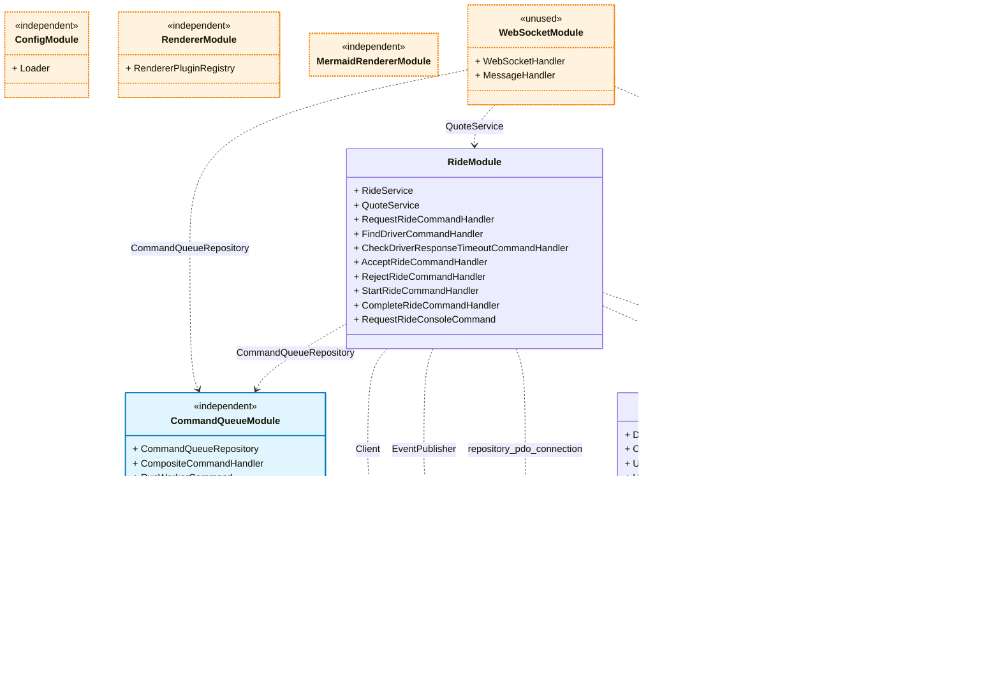

# Ride-Hailing Dispatch System

A real-time ride-hailing backend system built with PHP 8.4, featuring asynchronous job processing, WebSocket-based real-time communication, and PostGIS-powered geospatial queries.

## 📋 Table of Contents

- [Overview](#overview)
- [Features](#features)
- [Architecture](#architecture)
- [Technology Stack](#technology-stack)
- [System Requirements](#system-requirements)
- [Installation & Setup](#installation--setup)
- [Running the Application](#running-the-application)
- [Testing](#testing)
- [API Documentation](#api-documentation)
- [System Design Decisions](#system-design-decisions)
- [Project Structure](#project-structure)

## 🎯 Overview

This is a backend system for a ride-hailing application (similar to Uber/Lyft) that manages:

- **Passenger ride requests** - Users can request rides via WebSocket with pickup and destination locations
- **Driver assignment** - Intelligent dispatch algorithm finds the closest available driver
- **Real-time updates** - WebSocket connections provide bidirectional communication with both passengers and drivers
- **Asynchronous processing** - Command queue handles ride dispatching asynchronously
- **Geospatial queries** - PostGIS enables efficient distance-based driver searches

## ✨ Features

### Core Functionality

- ✅ **Ride Management**: Create, track, and manage ride lifecycle (requested → dispatching → accepted → in progress → completed)
- ✅ **Smart Dispatch**: Automatically assigns closest available driver within configurable radius
- ✅ **Driver Tracking**: Real-time driver location and status management
- ✅ **Retry Logic**: Automatically retries driver assignment if driver rejects or doesn't respond
- ✅ **Real-time Updates**: WebSocket server broadcasts ride and driver state changes
- ✅ **Event Publishing**: Redis pub/sub for cross-service communication

### Technical Features

- 🔄 **Asynchronous Command Queue**: Non-blocking job processing with worker pool
- 🗺️ **Geospatial Indexing**: PostGIS for efficient location-based queries
- 🔒 **Transaction Safety**: ACID guarantees with database transactions
- 🧪 **Comprehensive Tests**: Unit and integration tests with PHPUnit
- 📊 **Code Quality Tools**: PHPStan (static analysis) and PHP CS Fixer (code style)

## 🏗️ Architecture

### System Components

```
┌─────────────┐         ┌──────────────────┐         ┌─────────────┐
│  Passenger  │◄───────►│  WebSocket       │────────►│  PostgreSQL │
│     App     │         │    Server        │         │   Database  │
└─────────────┘         └──────────────────┘         └─────────────┘
                                │                           │
                                │                           │
                                ▼                           │
                        ┌──────────────────┐                │
                        │  Command Queue   │◄───────────────┘
                        │   (PostgreSQL)   │
                        └──────────────────┘
                                │
                                ▼
                        ┌──────────────────┐
                        │  Queue Worker    │
                        │  (Background)    │
                        └──────────────────┘
                                │
                                ▼
                        ┌──────────────────┐         ┌─────────────┐
                        │  Event Publisher │────────►│    Redis    │
                        │   (Redis PubSub) │         │  (PubSub)   │
                        └──────────────────┘         └─────────────┘
                                                             │
                                                             ▼
┌─────────────┐         ┌──────────────────┐         ┌─────────────┐
│   Driver    │◄───────►│   WebSocket      │◄────────│   Redis     │
│     App     │         │     Server       │         │ Subscriber  │
└─────────────┘         └──────────────────┘         └─────────────┘
```

### Class dependency diagram



### Data Flow

1. **Ride Request**: Passenger sends `request_ride` message via WebSocket
2. **Queue Dispatch**: System enqueues `RequestRide` command
3. **Worker Processing**: Background worker processes command and enqueues `FindDriverCommand`
4. **Driver Assignment**: `FindDriverCommandHandler` finds closest driver and assigns ride
5. **Event Publishing**: `DriverFoundEvent` published to Redis channel `driver.{driverId}`
6. **Real-time Push**: WebSocket server receives events and broadcasts to connected driver
7. **Driver Response**: Driver sends `accept_ride` or `reject_ride` via WebSocket
8. **State Transitions**: Ride progresses through states (accepted → in progress → completed)

## 🛠️ Technology Stack

- **PHP 8.4** - Modern PHP with strict types and enums
- **PostgreSQL 17 + PostGIS 3.4** - Relational database with geospatial extensions
- **Redis 7** - Pub/sub messaging and caching
- **Ratchet** - WebSocket server for real-time communication
- **Symfony Console** - CLI command framework
- **Power Modules Framework** - Modular architecture with dependency injection
- **PHPUnit** - Testing framework
- **PHPStan** - Static analysis at maximum level
- **Docker & Docker Compose** - Containerized development environment

## 💻 System Requirements

- Docker 20.10+ and Docker Compose 2.0+
- Or for local development:
  - PHP 8.4+
  - PostgreSQL 17+ with PostGIS 3.4+
  - Redis 7+
  - Composer 2+

## 🚀 Installation & Setup

### Using Docker (Recommended)

1. **Clone the repository**
   ```bash
   git clone <repository-url>
   cd backend
   ```

2. **Install dependencies**
   ```bash
   composer install
   ```

3. **Start all services**
   ```bash
   docker-compose up -d
   ```

   This starts:
   - PostgreSQL with PostGIS (port 5432)
   - Redis (port 6379)
   - WebSocket Server (port 8080)
   - Command Queue Worker (background process)

4. **Verify services are running**
   ```bash
   docker-compose ps
   ```

   All services should show as "running" with healthy status.

### Database Setup

The database schema is automatically initialized via Docker volumes:
- PostGIS extensions enabled
- Tables created (users, drivers, rides, command_queue)
- Sample data seeded (test users and drivers)

### Environment Configuration

The `.env` file contains configuration for Docker Compose. For local development, modify these values:

```env
# Local development (without Docker)
REPOSITORY_DSN=pgsql:host=localhost;port=5432;dbname=rhd;
REPOSITORY_USER=rhd
REPOSITORY_PASSWORD=rhd

COMMAND_QUEUE_DSN=pgsql:host=localhost;port=5432;dbname=rhd;
COMMAND_QUEUE_USER=rhd
COMMAND_QUEUE_PASSWORD=rhd

REDIS_HOST=localhost
REDIS_PORT=6379
```

## 🏃 Running the Application

### With Docker Compose (All-in-One)

```bash
# Start all services
docker-compose up -d

# View logs
docker-compose logs -f

# Stop services
docker-compose down
```

### Manual Start (Local Development)

If running outside Docker, start each component separately:

1. **Start PostgreSQL and Redis**
   ```bash
   # Ensure PostgreSQL with PostGIS and Redis are running
   ```

2. **Start the Command Queue Worker**
   ```bash
   php bin/console command-queue:run-worker
   ```

3. **Start the WebSocket Server**
   ```bash
   php bin/websocket-server
   ```

4. **WebSocket API is Ready**
   - Connect to `ws://localhost:8080`
   - Send JSON messages for authentication and commands
   - Receive real-time events from the server
   - See [WebSocket Communication](#websocket-communication) for message formats

### Testing WebSocket Connection

```bash
# Using websocat (install: cargo install websocat)
websocat ws://localhost:8080

# Or use browser console
const ws = new WebSocket('ws://localhost:8080');
ws.onmessage = (e) => console.log(JSON.parse(e.data));
```

## 🧪 Testing

### Run All Tests

```bash
make test
```

This command:
- Automatically sets up a test database
- Runs the complete test suite with PHPUnit
- Provides colored output for better readability

**Note**: Always use `make test` as it includes the test database setup. Running `vendor/bin/phpunit` directly may fail if the test database isn't properly configured.

### Run Specific Test Suite

The recommended way to run tests is always with `make test`. If you need to run specific tests, ensure the test database is set up first:

```bash
# Setup test database first
php test/setup-test-db.php

# Then run specific tests
vendor/bin/phpunit test/Driver/
vendor/bin/phpunit test/Ride/
vendor/bin/phpunit test/CommandQueue/
```

### Test Coverage

Tests cover:
- ✅ Driver assignment logic with geospatial queries
- ✅ Ride state transitions and validation
- ✅ Command queue processing
- ✅ Composite command handler registration
- ✅ Distance, duration, and money calculations
- ✅ Repository operations with transactions

### Code Quality Checks

```bash
# Run PHPStan static analysis (level 9)
make phpstan

# Check code style
make codestyle

# Auto-fix code style
vendor/bin/php-cs-fixer fix
```

## 📚 API Documentation

### WebSocket Communication

The system uses WebSocket for all client communication - both passengers and drivers connect to the same WebSocket server on port 8080.

#### Message Format

All messages are JSON with a `type` field:
```json
{
  "type": "message_type",
  "field1": "value1",
  "field2": "value2"
}
```

#### Passenger Messages

**Authentication**
```json
{
  "type": "auth_user",
  "user_id": "uuid-here"
}
```

**Request Quote**
```json
{
  "type": "request_quote",
  "departure_lat": 40.7128,
  "departure_lon": -74.0060,
  "destination_lat": 40.7580,
  "destination_lon": -73.9855
}
```

**Request Ride**
```json
{
  "type": "request_ride",
  "user_id": "uuid-here",
  "departure_lat": 40.7128,
  "departure_lon": -74.0060,
  "destination_lat": 40.7580,
  "destination_lon": -73.9855
}
```

#### Driver Messages

**Authentication**
```json
{
  "type": "auth_driver",
  "driver_id": "uuid-here"
}
```

**Update Location**
```json
{
  "type": "update_location",
  "driver_id": "uuid-here",
  "lat": 40.7128,
  "lon": -74.0060
}
```

**Update Status**
```json
{
  "type": "update_status",
  "driver_id": "uuid-here",
  "status": "available" // or "busy", "offline"
}
```

**Accept Ride**
```json
{
  "type": "accept_ride",
  "ride_id": "uuid-here",
  "driver_id": "uuid-here"
}
```

**Reject Ride**
```json
{
  "type": "reject_ride",
  "ride_id": "uuid-here",
  "driver_id": "uuid-here"
}
```

**Start Ride**
```json
{
  "type": "start_ride",
  "ride_id": "uuid-here",
  "driver_id": "uuid-here"
}
```

**Complete Ride**
```json
{
  "type": "complete_ride",
  "ride_id": "uuid-here",
  "driver_id": "uuid-here"
}
```

#### Server Events

The server sends events to clients via Redis pub/sub channels:
- `user.{userId}` - Events for passengers
- `driver.{driverId}` - Events for drivers

**Event Types:**
- `DriverFoundEvent` - Driver assigned to passenger's ride
- `RideAcceptedEvent` - Driver accepted the ride
- `RideStartedEvent` - Ride started (passenger picked up)
- `RideCompletedEvent` - Ride completed
- `NoDriverAvailableEvent` - No drivers available for ride
- `DriverRideRequestTimeoutEvent` - Driver didn't respond in time

### Domain Models

#### Ride States
- `requested` - Initial state when passenger creates ride
- `dispatching` - System is finding and assigning a driver
- `driver_accepted` - Driver confirmed and is heading to pickup
- `in_progress` - Passenger picked up, ride in progress
- `completed` - Ride finished successfully
- `cancelled` - Ride cancelled by passenger or system

#### Driver Status
- `available` - Ready to accept rides
- `busy` - Currently on a ride
- `offline` - Not accepting rides

### Key Components

#### ClosestDriverFinder
Finds the nearest available driver using PostGIS distance calculations:
```php
$driver = $closestDriverFinder->findClosestAvailableDriver(
    location: $pickupLocation,
    excludeDriverIds: $rejectedDrivers, // Exclude drivers who rejected
    maxDistance: new Distance(5000) // Within 5km radius (5000 meters)
);
```

#### RideService
Manages ride lifecycle and state transitions:
```php
// Create new ride
$ride = $rideService->create($ride);

// Mark as dispatching (worker picks it up)
$ride = $rideService->markAsDispatching($rideId);

// Assign driver
$ride = $rideService->assignDriver($rideId, $driverId);

// Cancel ride
$ride = $rideService->cancel($rideId);
```

#### Command Handlers

The system uses command handlers for asynchronous processing:

- `RequestRideCommandHandler` - Creates ride and enqueues `FindDriverCommand`
- `FindDriverCommandHandler` - Finds closest driver, handles retries, publishes `DriverFoundEvent`
- `AcceptRideCommandHandler` - Driver accepts ride, publishes `RideAcceptedEvent`
- `RejectRideCommandHandler` - Driver rejects, retries with next closest driver
- `CheckDriverResponseTimeoutCommandHandler` - Handles driver timeout, retries assignment
- `StartRideCommandHandler` - Marks ride as in progress, publishes `RideStartedEvent`
- `CompleteRideCommandHandler` - Completes ride, publishes `RideCompletedEvent`
- `UpdateDriverLocationCommandHandler` - Updates driver GPS location
- `UpdateDriverStatusCommandHandler` - Changes driver status (available/busy/offline)

## 🎨 System Design Decisions

### 1. Command Queue Pattern

**Problem**: Ride dispatching involves complex logic (finding drivers, retrying rejections) that shouldn't block WebSocket responses.

**Solution**: Implemented a command queue with background workers.

**Benefits**:
- Fast response times for passengers
- Retry logic without blocking
- Scalable (add more workers as needed)
- Failure isolation

**Implementation**: PostgreSQL-based queue with `FOR UPDATE SKIP LOCKED` for worker coordination.

### 2. PostGIS for Geospatial Queries

**Problem**: Need to efficiently find drivers near a location, sorted by distance.

**Solution**: PostgreSQL with PostGIS extension using spatial indexes.

**Benefits**:
- Efficient distance calculations (haversine formula)
- Built-in sorting by proximity
- GiST indexes for fast queries
- ACID transactions for consistency

**Query Example**:
```sql
SELECT * FROM drivers 
WHERE status = 'available'
ORDER BY location <-> ST_MakePoint($lat, $lon)
LIMIT 1;
```

### 3. Real-time Updates via WebSocket

**Problem**: Passengers and drivers need immediate notifications of state changes, and need a way to send commands.

**Solution**: Bidirectional WebSocket server + Redis pub/sub for events.

**Benefits**:
- Persistent connections (no polling)
- Bidirectional communication (send commands, receive events)
- Low latency (<100ms)
- Decoupled services (worker → Redis → WebSocket)
- Single connection handles both passenger and driver apps

**Architecture**: 
- **Inbound**: WebSocket receives messages → Enqueues commands → Worker processes
- **Outbound**: Worker publishes events → Redis pub/sub → WebSocket subscriber → Broadcast to specific clients

### 4. Event-Driven Architecture

**Problem**: Multiple components need to react to state changes (ride assigned, driver location updated).

**Solution**: Event publishing with Redis pub/sub channels (`user.{userId}` and `driver.{driverId}`).

**Benefits**:
- Loose coupling between services
- Easy to add new consumers
- Targeted delivery (events sent only to relevant clients)
- Real-time reactivity

**Events**: `DriverFoundEvent`, `RideAcceptedEvent`, `RideStartedEvent`, `RideCompletedEvent`, `NoDriverAvailableEvent`, `DriverRideRequestTimeoutEvent`

### 5. Immutable Domain Models

**Problem**: Mutable state causes bugs and race conditions.

**Solution**: Readonly classes with `with*()` methods for state changes.

**Benefits**:
- Thread-safe (important for workers)
- Clear state transitions
- Easier testing
- Prevents accidental mutations

### 6. Modular Architecture

**Problem**: Monolithic code becomes hard to maintain.

**Solution**: Domain-driven design with separate modules (Driver, Ride, User, CommandQueue).

**Benefits**:
- Clear boundaries
- Independent testing
- Easy to understand
- Reusable components

### 7. Retry Logic for Driver Assignment

**Problem**: Drivers may reject rides or not respond.

**Solution**: Track rejected drivers and retry with next closest driver.

**Implementation**:
```php
class RejectedDriversTracker {
    public function recordRejection(Id $rideId, Id $driverId): void;
    public function getRejectedDriverIds(Id $rideId): array;
}
```

**Flow** (handled by `FindDriverCommandHandler` and `CheckDriverResponseTimeoutCommandHandler`):
1. Find closest driver
2. Assign and publish `DriverFoundEvent`
3. Enqueue `CheckDriverResponseTimeoutCommand` (30 second timeout)
4. If rejected via `RejectRideCommandHandler`, call `recordRejection()` to track
5. If timeout expires, `CheckDriverResponseTimeoutCommandHandler` retries
6. Find next closest (excluding rejected via `getRejectedDriverIds()`)
7. Repeat until accepted or max retries (3 attempts) or max search radius (15km)

## 📁 Project Structure

```
backend/
├── bin/
│   ├── console              # CLI entry point (Symfony Console)
│   └── websocket-server     # WebSocket server entry point
├── src/
│   ├── Driver/              # Driver domain
│   │   ├── Driver.php       # Driver entity
│   │   ├── DriverService.php
│   │   ├── ClosestDriverFinder.php  # Geospatial search
│   │   ├── Status.php       # Driver status enum
│   │   ├── Queue/           # Driver command handlers
│   │   └── Infra/           # Repository implementations
│   ├── Ride/                # Ride domain
│   │   ├── Ride.php         # Ride entity
│   │   ├── RideService.php
│   │   ├── State.php        # Ride state enum
│   │   ├── RejectedDriversTracker.php
│   │   ├── Queue/           # Ride command handlers (dispatch logic)
│   │   └── Infra/           # Repository implementations
│   ├── User/                # User domain
│   │   ├── User.php
│   │   └── Infra/
│   ├── CommandQueue/        # Async job processing
│   │   ├── CommandQueue.php
│   │   ├── Worker.php
│   │   ├── CompositeCommandHandler.php
│   │   └── Infra/
│   ├── WebSocket/           # Real-time communication
│   │   ├── WebSocketHandler.php
│   │   ├── MessageHandler.php
│   │   └── RedisSubscriber.php
│   ├── Shared/              # Shared value objects
│   │   ├── Id.php
│   │   ├── Money.php
│   │   ├── Distance.php
│   │   ├── Duration.php
│   │   ├── Location/
│   │   └── EventPublisher.php
│   └── Infra/               # Infrastructure setup
├── test/                    # Test suite
│   ├── Driver/
│   ├── Ride/
│   ├── CommandQueue/
│   └── Fixture/             # Test fixtures
├── docker-compose.yml       # Service orchestration
├── Dockerfile
├── .env                     # Environment configuration
├── composer.json            # PHP dependencies
├── phpstan.neon            # Static analysis config
└── Makefile                # Development commands
```

### Key Files

- **`src/Ride/Queue/FindDriverCommandHandler.php`** - Core dispatch logic with retry and expanding search radius
- **`src/Ride/Queue/RequestRideCommandHandler.php`** - Handles ride creation from WebSocket
- **`src/Ride/Queue/CheckDriverResponseTimeoutCommandHandler.php`** - Manages driver response timeouts
- **`src/Driver/ClosestDriverFinder.php`** - Geospatial driver search
- **`src/CommandQueue/Worker.php`** - Background job processor
- **`src/WebSocket/MessageHandler.php`** - Processes incoming WebSocket messages
- **`src/WebSocket/RedisSubscriber.php`** - Event consumer for real-time updates
- **`docker-compose.yml`** - Complete service stack definition

## 🔧 Development

### Adding New Commands

1. Create command class implementing `ICommandHandler`
2. Register in module's `getCommandHandlers()` method
3. Enqueue via `$commandQueueRepository->enqueue($command)`

### Adding Real-time Events

1. Publish event: `$eventPublisher->publish("user.{$userId}", $event)` or `$eventPublisher->publish("driver.{$driverId}", $event)`
2. WebSocket server automatically receives and broadcasts via Redis subscriber
3. Clients listen: `ws.onmessage = (e) => handleEvent(JSON.parse(e.data))`

### Database Migrations

Schema files are in `src/*/Infra/*.sql`. To reset database:
```bash
docker-compose down -v  # Removes volumes
docker-compose up -d    # Recreates with fresh data
```

## 🐛 Troubleshooting

### Worker not processing commands
```bash
# Check worker logs
docker-compose logs command-queue-worker

# Restart worker
docker-compose restart command-queue-worker
```

### WebSocket connection refused
```bash
# Check if server is running
docker-compose logs websocket

# Check port availability
netstat -an | grep 8080
```

### Database connection errors
```bash
# Verify PostgreSQL is healthy
docker-compose ps postgres

# Check logs
docker-compose logs postgres
```

## 📝 License

This is a technical assessment project for demonstration purposes.

## 👤 Author

**Evgenii Teterin**

Developed as a technical assessment to demonstrate:
- Clean architecture and SOLID principles
- Asynchronous processing patterns
- Real-time communication systems
- Geospatial data handling
- Test-driven development
- Modern PHP best practices

---

**Built with ❤️ using modern PHP and best practices**
